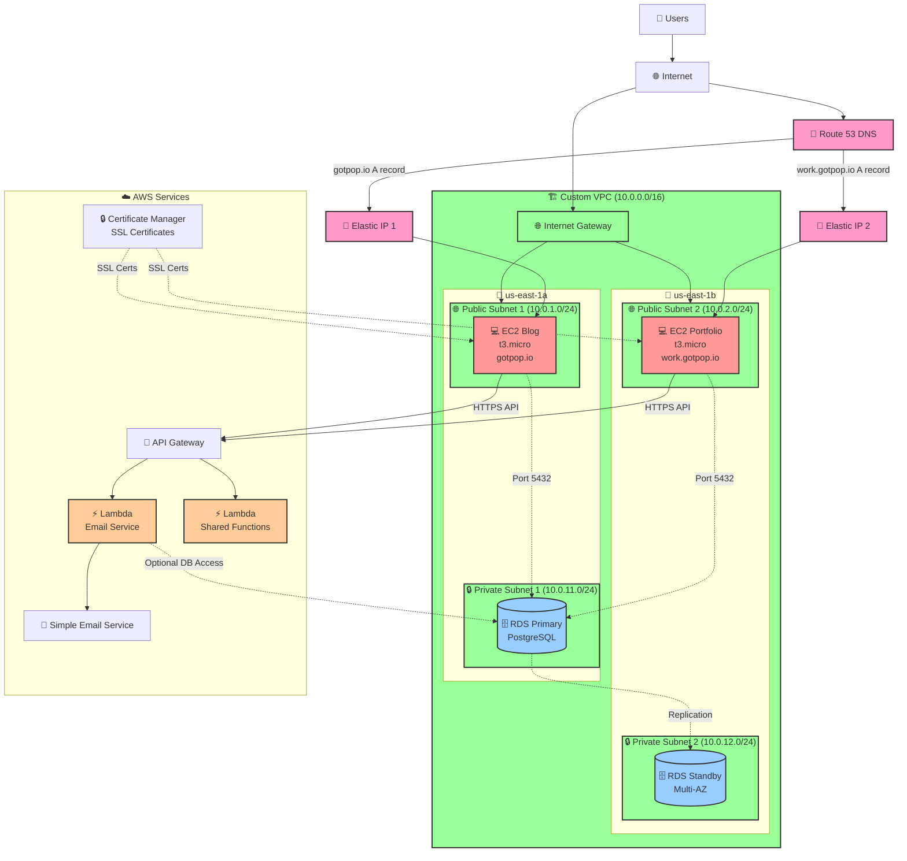
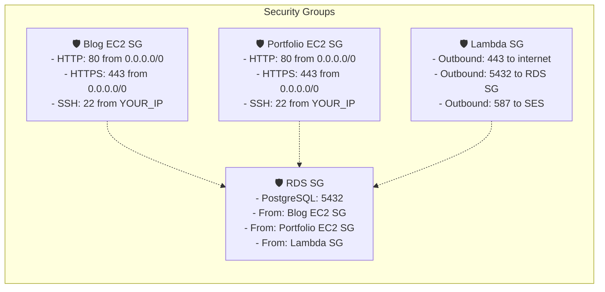

# AWS Architecture for gotpop.io

## Complete Architecture Diagram

## Security Groups Overview

## Cost Breakdown (Monthly)

| Service        | Type                  | Cost              |
| -------------- | --------------------- | ----------------- |
| EC2 Blog       | t3.micro              | ~$8.50            |
| EC2 Portfolio  | t3.micro              | ~$8.50            |
| RDS PostgreSQL | db.t3.micro           | ~$13.00           |
| Elastic IPs    | 2 IPs                 | ~$7.30            |
| Lambda         | Pay per use           | ~$1-5             |
| Route 53       | Hosted zone + queries | ~$1.00            |
| **Total**      |                       | **~$39-44/month** |

_Note: First year eligible for AWS Free Tier discounts_

## Deployment Phases

### Phase 1: Basic Setup ✅

- [x] VPC with public/private subnets
- [x] Two EC2 instances with Elastic IPs
- [x] Route 53 DNS configuration
- [x] Basic security groups

### Phase 2: Applications 🔄

- [ ] Deploy Next.js blog to EC2
- [ ] Deploy Next.js portfolio to EC2
- [ ] Configure Nginx + SSL certificates
- [ ] Test both domains

### Phase 3: Database 📅

- [ ] Create RDS PostgreSQL instance
- [ ] Configure database security groups
- [ ] Update applications for database connectivity
- [ ] Set up database migrations

### Phase 4: Shared Services 📅

- [ ] Create Lambda functions for email service
- [ ] Set up API Gateway endpoints
- [ ] Configure SES for email delivery
- [ ] Integrate applications with shared services

## Learning Opportunities

This architecture teaches you:

- ✅ **VPC networking** - Subnets, routing, security groups
- ✅ **EC2 management** - Instance types, Elastic IPs, SSH access
- ✅ **Database security** - Private subnets, security group rules
- ✅ **DNS management** - Route 53 A records, subdomain routing
- ✅ **Serverless computing** - Lambda functions, API Gateway
- ✅ **SSL/TLS** - Certificate management, HTTPS configuration
- ✅ **Monitoring** - CloudWatch logs and metrics
- ✅ **Cost optimization** - Right-sizing instances, free tier usage
