# AWS Architecture for gotpop.io

## Complete Architecture Diagram

```mermaid
graph TB
    %% External Layer
    Users[👥 Users] --> Internet[🌐 Internet]
    Internet --> R53[📍 Route 53 DNS]

    %% DNS Routing
    R53 --> |gotpop.io A record| EIP1[📌 Elastic IP 1]
    R53 --> |work.gotpop.io A record| EIP2[📌 Elastic IP 2]

    %% VPC Container
    subgraph VPC["🏗️ Custom VPC (10.0.0.0/16)"]
        %% Availability Zones
        subgraph AZ1["📍 us-east-1a"]
            subgraph PubSub1["🌐 Public Subnet 1 (10.0.1.0/24)"]
                EC2B[💻 EC2 Blog<br/>t3.micro<br/>gotpop.io]
            end
            subgraph PrivSub1["🔒 Private Subnet 1 (10.0.11.0/24)"]
                RDS1[(🗄️ RDS Primary<br/>PostgreSQL)]
            end
        end

        subgraph AZ2["📍 us-east-1b"]
            subgraph PubSub2["🌐 Public Subnet 2 (10.0.2.0/24)"]
                EC2P[💻 EC2 Portfolio<br/>t3.micro<br/>work.gotpop.io]
            end
            subgraph PrivSub2["🔒 Private Subnet 2 (10.0.12.0/24)"]
                RDS2[(🗄️ RDS Standby<br/>Multi-AZ)]
            end
        end

        %% Internet Gateway
        IGW[🌐 Internet Gateway]
    end

    %% External Services
    subgraph AWS["☁️ AWS Services"]
        Lambda1[⚡ Lambda<br/>Email Service]
        Lambda2[⚡ Lambda<br/>Shared Functions]
        APIGW[🔗 API Gateway]
        SES[📧 Simple Email Service]
        ACM[🔒 Certificate Manager<br/>SSL Certificates]
    end

    %% Connections
    EIP1 --> EC2B
    EIP2 --> EC2P
    IGW --> PubSub1
    IGW --> PubSub2
    Internet --> IGW

    %% Database Connections
    EC2B -.->|Port 5432| RDS1
    EC2P -.->|Port 5432| RDS1
    RDS1 -.->|Replication| RDS2

    %% Lambda Connections
    EC2B --> |HTTPS API| APIGW
    EC2P --> |HTTPS API| APIGW
    APIGW --> Lambda1
    APIGW --> Lambda2
    Lambda1 --> SES
    Lambda1 -.->|Optional DB Access| RDS1

    %% SSL
    ACM -.->|SSL Certs| EC2B
    ACM -.->|SSL Certs| EC2P

    %% Styling
    classDef ec2 fill:#ff9999,stroke:#333,stroke-width:2px
    classDef database fill:#99ccff,stroke:#333,stroke-width:2px
    classDef lambda fill:#ffcc99,stroke:#333,stroke-width:2px
    classDef network fill:#99ff99,stroke:#333,stroke-width:2px
    classDef dns fill:#ff99cc,stroke:#333,stroke-width:2px

    class EC2B,EC2P ec2
    class RDS1,RDS2 database
    class Lambda1,Lambda2 lambda
    class VPC,IGW,PubSub1,PubSub2,PrivSub1,PrivSub2 network
    class R53,EIP1,EIP2 dns
```

## Security Groups Overview

```mermaid
graph LR
    subgraph "Security Groups"
        SG1[🛡️ Blog EC2 SG<br/>- HTTP: 80 from 0.0.0.0/0<br/>- HTTPS: 443 from 0.0.0.0/0<br/>- SSH: 22 from YOUR_IP]

        SG2[🛡️ Portfolio EC2 SG<br/>- HTTP: 80 from 0.0.0.0/0<br/>- HTTPS: 443 from 0.0.0.0/0<br/>- SSH: 22 from YOUR_IP]

        SG3[🛡️ RDS SG<br/>- PostgreSQL: 5432<br/>- From: Blog EC2 SG<br/>- From: Portfolio EC2 SG<br/>- From: Lambda SG]

        SG4[🛡️ Lambda SG<br/>- Outbound: 443 to internet<br/>- Outbound: 5432 to RDS SG<br/>- Outbound: 587 to SES]
    end

    SG1 -.-> SG3
    SG2 -.-> SG3
    SG4 -.-> SG3
```

## Cost Breakdown (Monthly)

| Service        | Type                  | Cost              |
| -------------- | --------------------- | ----------------- |
| EC2 Blog       | t3.micro              | ~$8.50            |
| EC2 Portfolio  | t3.micro              | ~$8.50            |
| RDS PostgreSQL | db.t3.micro           | ~$13.00           |
| Elastic IPs    | 2 IPs                 | ~$7.30            |
| Lambda         | Pay per use           | ~$1-5             |
| Route 53       | Hosted zone + queries | ~$1.00            |
| **Total**      |                       | **~$39-44/month** |

_Note: First year eligible for AWS Free Tier discounts_

## Deployment Phases

### Phase 1: Basic Setup ✅

- [x] VPC with public/private subnets
- [x] Two EC2 instances with Elastic IPs
- [x] Route 53 DNS configuration
- [x] Basic security groups

### Phase 2: Applications 🔄

- [ ] Deploy Next.js blog to EC2
- [ ] Deploy Next.js portfolio to EC2
- [ ] Configure Nginx + SSL certificates
- [ ] Test both domains

### Phase 3: Database 📅

- [ ] Create RDS PostgreSQL instance
- [ ] Configure database security groups
- [ ] Update applications for database connectivity
- [ ] Set up database migrations

### Phase 4: Shared Services 📅

- [ ] Create Lambda functions for email service
- [ ] Set up API Gateway endpoints
- [ ] Configure SES for email delivery
- [ ] Integrate applications with shared services

## Learning Opportunities

This architecture teaches you:

- ✅ **VPC networking** - Subnets, routing, security groups
- ✅ **EC2 management** - Instance types, Elastic IPs, SSH access
- ✅ **Database security** - Private subnets, security group rules
- ✅ **DNS management** - Route 53 A records, subdomain routing
- ✅ **Serverless computing** - Lambda functions, API Gateway
- ✅ **SSL/TLS** - Certificate management, HTTPS configuration
- ✅ **Monitoring** - CloudWatch logs and metrics
- ✅ **Cost optimization** - Right-sizing instances, free tier usage
